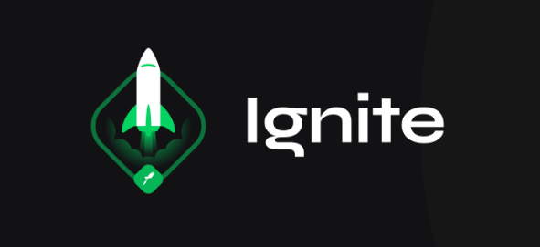

<h1 align="center">🚀 Desafio Ignite - Trilha NodeJS</h1>

  Desafio: Trabalhando com Middleware
   
  

<h1 align="center">:pushpin: Sobre o desafio</h1>
Nesse desafio foi trabalhado mais a fundo com middlewares no Express. Para facilitar mais o conhecimento da regra de negócio,  trabalhamos com a mesma aplicação do desafio anterior: uma aplicação para gerenciar tarefas (ou todos) mas com algumas mudanças. 
Tudo isso para cada usuário em específico. Além disso, dessa vez tivemos um plano grátis onde o usuário só pode criar até dez todos e um plano Pro que irá permitir criar todos ilimitados, isso tudo usando middlewares para fazer as validações necessárias.

## :memo: Licença

Esse projeto está sob a licença MIT. Veja o arquivo [LICENSE](https://github.com/git/git-scm.com/blob/master/MIT-LICENSE.txt) para mais detalhes.

---

Feito com 💜 by <a href="https://www.linkedin.com/in/dayanegorgonha/">Dayane Gorgonha</a> 